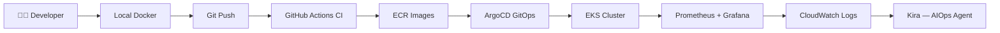
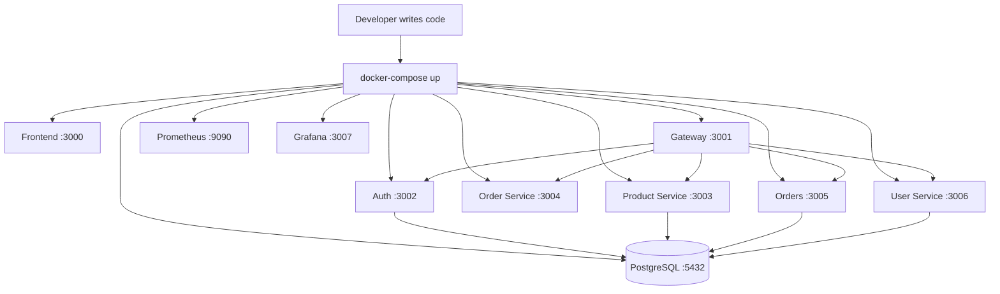
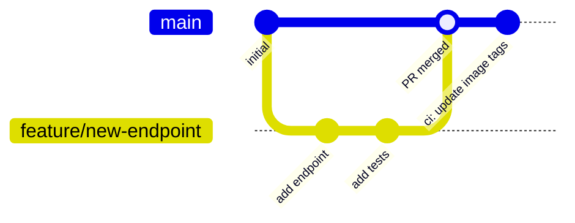
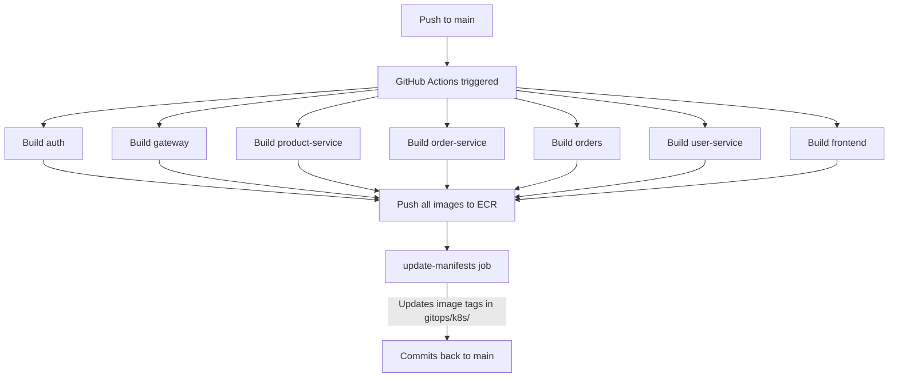
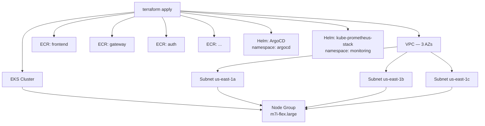
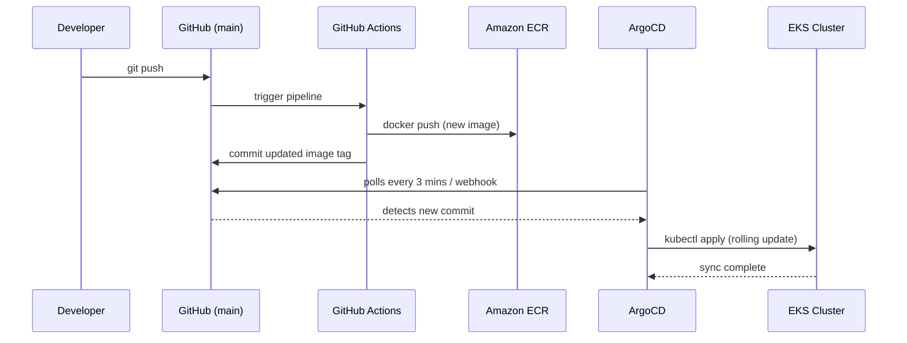
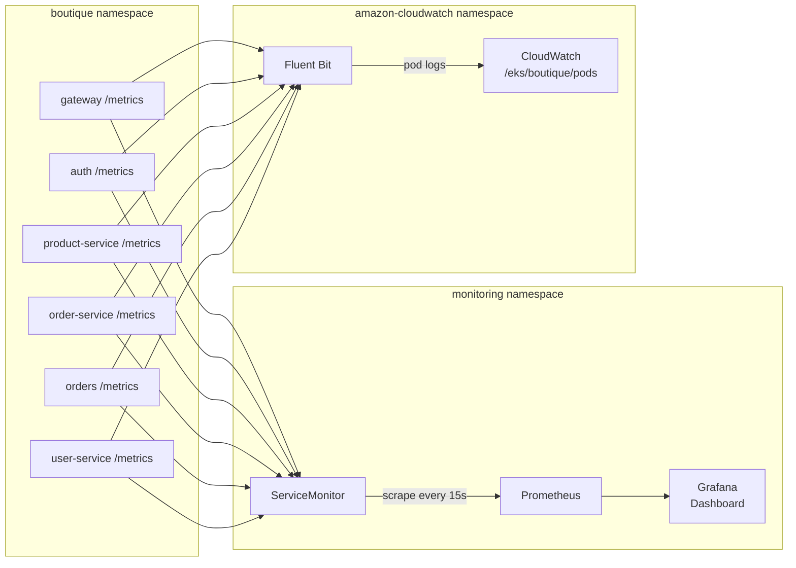
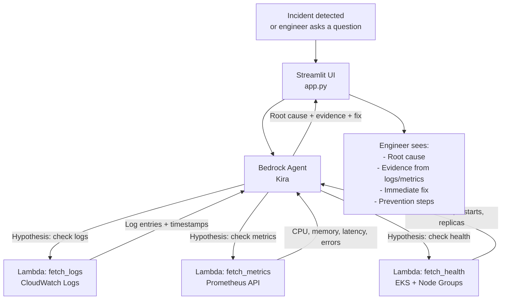
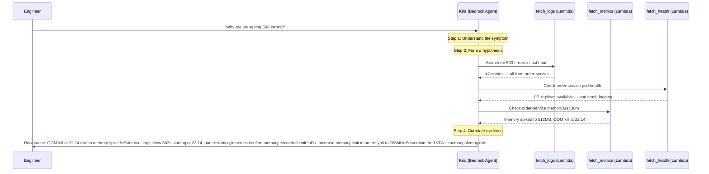
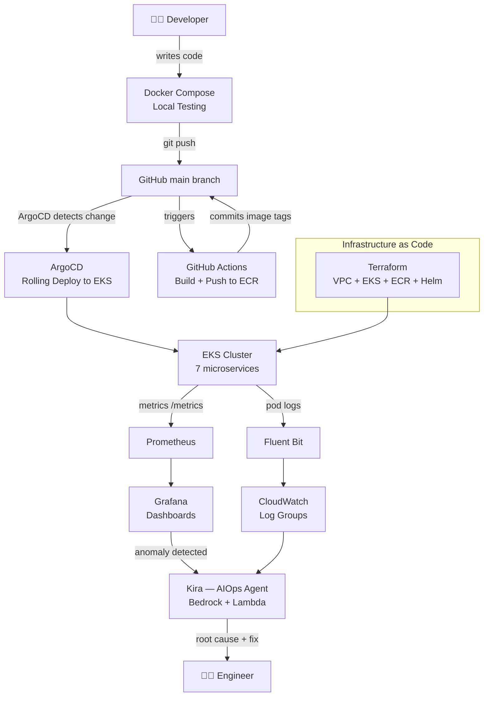

# Part 2 — Understanding the Workflow

> Companion doc for the YouTube series: **DevOps + AIOps Series** — Part 2

---

## Overview

Before writing any code or deployment configs, you need to understand how the entire system flows. This part traces the complete journey — from a developer writing code locally, all the way to an AI assistant diagnosing incidents in production.

---

## Stage 1: Local Development

Every change starts on a developer's machine. The full application stack runs locally using Docker Compose — no cloud account required.

Each service has its own `Dockerfile`. Docker Compose wires them together with a shared network, letting you test the full system locally before touching any cloud infrastructure.

**What to verify locally:**
- All containers show `Up` in `docker ps`
- Frontend loads at http://localhost:3000
- `/api/products` returns data via the gateway
- Prometheus scrapes metrics from `/metrics` endpoints
- Grafana dashboards show live data

---

## Stage 2: Source Control

Once a change is tested locally, it goes into Git.

**The flow:**
1. Developer creates a feature branch
2. Makes changes, commits with clear messages
3. Opens a Pull Request on GitHub
4. PR is reviewed and merged into `main`
5. Merge to `main` triggers the CI pipeline automatically

Everything is tracked — who changed what, when, and why. This is the foundation of GitOps.

---

## Stage 3: CI Pipeline — GitHub Actions

On every push to `main`, GitHub Actions builds Docker images for all 7 services in parallel and pushes them to Amazon ECR.

**Key concepts:**
- Each service is a separate matrix job — they all build in parallel
- Images are tagged with the commit SHA for full traceability
- The `update-manifests` job patches the image tag in every Kubernetes manifest and commits the change back
- This commit is what ArgoCD detects to trigger a rollout

**Where to check:** GitHub repo → **Actions** tab → **Boutique CI Pipeline**

---

## Stage 4: Infrastructure — Terraform on AWS

Before the cluster can run anything, the infrastructure must exist. Terraform provisions everything from scratch.

Terraform also installs ArgoCD and the Prometheus/Grafana stack into the cluster via Helm — so the entire platform is ready to receive workloads the moment `terraform apply` finishes.

---

## Stage 5: GitOps Deployment — ArgoCD

ArgoCD runs inside the cluster and watches the `main` branch. The moment the CI pipeline commits updated image tags back to Git, ArgoCD detects the change and rolls out the new version.

**What ArgoCD does:**
- Continuously compares the desired state in Git against the live state in the cluster
- If they differ, it syncs — applying only what changed
- If someone manually changes something in the cluster, ArgoCD reverts it to match Git
- Every deployment is auditable — it's just a Git commit

**Key files:**
- `gitops/argo-cd.yml` — registers the repo and branch with ArgoCD
- `gitops/kustomization.yml` — lists all Kubernetes resources to apply
- `gitops/k8s/` — all service deployments, services, database, secrets

---

## Stage 6: Observability

Once the application is running in EKS, three layers of observability keep watch.

**Metrics — Prometheus + Grafana**
- Every service exposes a `/metrics` endpoint using `prom-client`
- A `ServiceMonitor` resource tells the Prometheus Operator which pods to scrape
- Grafana is pre-loaded with a boutique dashboard via a ConfigMap labelled `grafana_dashboard: "1"` — the Grafana sidecar auto-imports it

**Logs — Fluent Bit + CloudWatch**
- Fluent Bit runs as a DaemonSet in `amazon-cloudwatch`
- Captures stdout from every pod and ships logs to CloudWatch
- Log group: `/eks/boutique/pods`

**What to check in Grafana:**
- Request rate by service
- p95 / p99 response times
- 4xx and 5xx error rates
- Pod CPU and memory usage
- Pod restart count — surfaces crash loops early

---

## Stage 7: AIOps — Kira (Bedrock Agent)

This is where the workflow goes beyond traditional DevOps. When something goes wrong in production, instead of manually digging through logs and metrics, you ask Kira.

**How Kira investigates:**

**The Kira workflow:**
1. Engineer describes a symptom
2. Kira forms a hypothesis
3. Gathers evidence using the 3 Lambda tools (logs, metrics, health)
4. Correlates data across all three sources
5. Returns root cause, supporting evidence, immediate fix, and prevention steps

**Kira never guesses.** Every conclusion is backed by specific log entries or metric values.

---

## The Complete Picture

---

## Key Files Reference

| File | Stage | Purpose |
|------|-------|---------|
| `projects/boutique-microservices/docker-compose.yml` | Stage 1 | Local stack |
| `.github/workflows/ci.yml` | Stage 3 | Build and push images |
| `projects/Infrastructure/` | Stage 4 | Terraform for AWS |
| `gitops/argo-cd.yml` | Stage 5 | ArgoCD application definition |
| `gitops/k8s/` | Stage 5 | All Kubernetes manifests |
| `gitops/k8s/backend/service-monitor.yml` | Stage 6 | Prometheus scrape config |
| `gitops/k8s/grafana-dashboard.yml` | Stage 6 | Pre-loaded Grafana dashboard |
| `projects/aiops-assistant/` | Stage 7 | Kira — AIOps Bedrock Agent |
